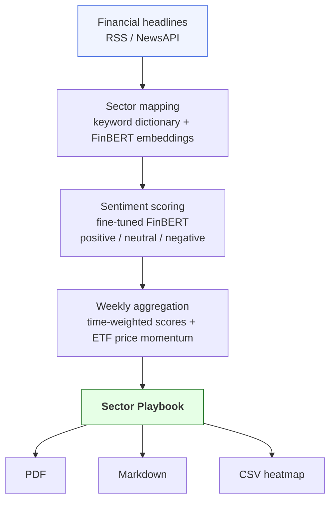

# SectorPulse – Technical details

## Description

SectorPulse ingests financial headlines daily, scores their sentiment using a fine-tuned FinBERT model, and aggregates signals across the 11 GICS sectors. 

Every Monday it produces a one-page **Sector Playbook** 
identifying the top 3 sectors to overweight and the bottom 3 to avoid, 
with ETF mappings and week-over-week momentum confirmation.



## Project structure

```
sector-pulse/
├── data/
│   ├── raw/               # Raw headlines
│   ├── etf_prices/        # ETF price (yfinance)
│   ├── fred/              # Macro data series (FRED)
├── models/
│   └── finbert_finetuned/ # local finetuned FinBERT model
├── src/
│   ├── main/
│   │   ├── ingestion/     # RSS + NewsAPI ingestion
│   │   ├── mapping/       # mapping text → sector
│   └── test/
├── notebooks/             # exploration 
└── README.md
```