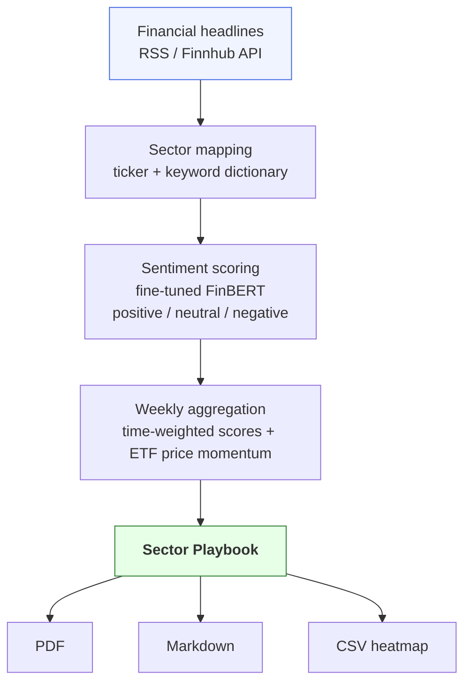

# SectorPulse – Technical details

## Description

SectorPulse ingests financial headlines daily, scores their sentiment using a fine-tuned FinBERT model, and aggregates signals across the 11 GICS sectors. 

Every Monday it produces a one-page **Sector Playbook** 
identifying the top 3 sectors to overweight and the bottom 3 to avoid, 
with ETF mappings and week-over-week momentum confirmation.



## Project structure

```
sector-pulse/
├── data/
│   ├── raw/                              # Raw headlines (CSV + SQLite)
│   │   ├── headlines.csv                 # All ingested headlines
│   │   └── headlines_sector_mapped.csv   # C13 output: mapped sectors
│   ├── yfinance/                         # SPDR ETF OHLCV data (11 tickers)
│   ├── fred/                             # Macro data series (FRED)
│   ├── C02_mapping_secteur_ETF_top5_holdings.csv  # Top-5 holdings per sector
│   ├── C02_mapping_secteur_ETF_tous_tickers-2.csv # All holdings per sector
│   ├── sector_keywords.json              # Keyword dictionary for sector mapping
│   └── sector_keywords.csv
├── scripts/
│   ├── ingest_headlines.py   # C12: RSS + Finnhub ingestion → headlines.csv
│   ├── ingest_ohlcv.py       # SPDR ETF OHLCV via yfinance
│   ├── ingest_fred.py        # Macro indicators via FRED API
│   └── map_sector.py         # C13: text → sector mapping (Level 1 + 2)
├── server/
│   ├── main/
│   │   └── main.py           # Entry point (stub)
│   └── test/
│       └── test_headline_ingest.py  # Standalone RSS exploration script
├── client/                   # (reserved)
├── models/
│   └── finbert_finetuned/    # Fine-tuned FinBERT weights (not yet populated)
├── notebooks/                # Jupyter exploration notebooks
├── pyproject.toml            # uv-managed dependencies
└── README.md
```