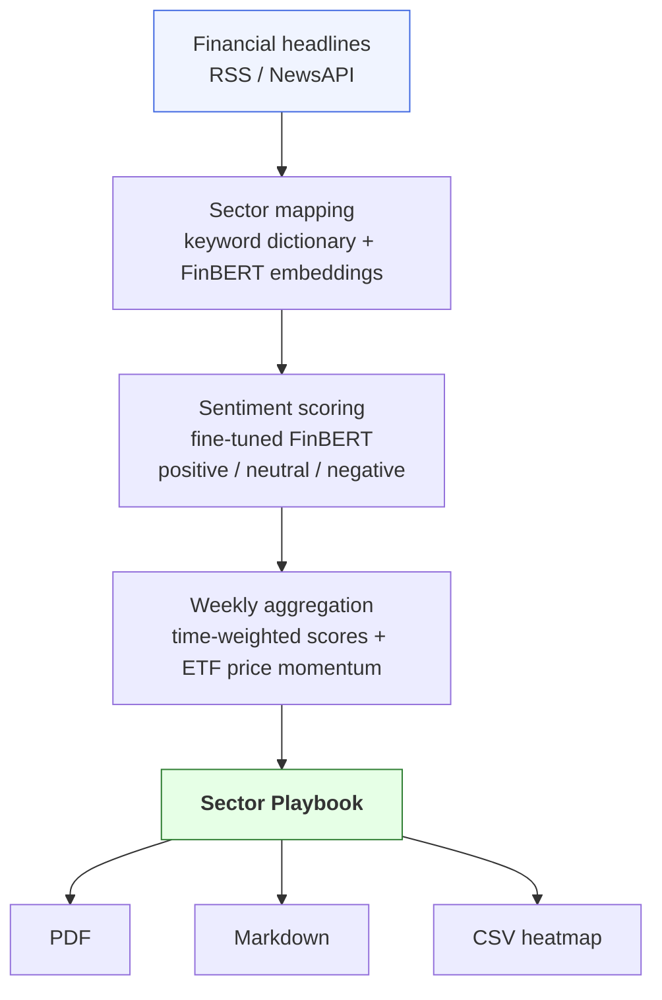

# SectorPulse

> Automated weekly sector sentiment playbook for US equity rotation — powered by FinBERT and financial news NLP.

## Requirements

* Python 3.12+

## Description

SectorPulse ingests financial headlines daily, scores their sentiment using a fine-tuned FinBERT model, and aggregates signals across the 11 GICS sectors. 

Every Monday it produces a one-page **Sector Playbook** 
identifying the top 3 sectors to overweight and the bottom 3 to avoid, 
with ETF mappings and week-over-week momentum confirmation.



## Project structure

```
sector-pulse/
├── data/
│   ├── raw/               # Raw headlines
│   ├── etf_prices/        # ETF price (yfinance)
│   ├── fred/              # Macro data series (FRED)
├── models/
│   └── finbert_finetuned/ # local finetuned FinBERT model
├── src/
│   ├── ingestion/         # RSS + NewsAPI ingestion
│   ├── mapping/           # mapping text → sector
├── notebooks/             # exploration 
└── README.md
```

## Quickstart

```bash
# sync venv + dependencies
uv sync 

# Copy & fill API keys in .env
cp .env.example .env 

```
## Disclaimer

SectorPulse is built for educational purposes. The Sector Playbook does not give financial advice. 